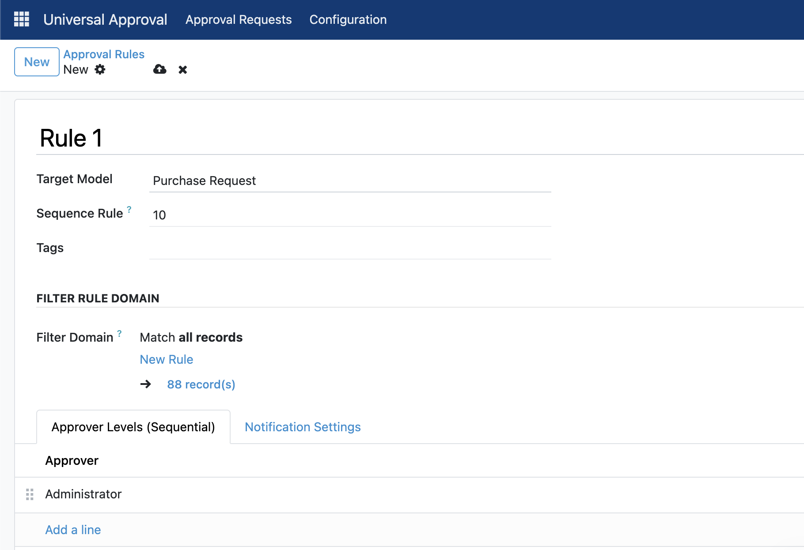

# Universal Approval for Odoo

Universal Approval is a configurable and reusable approval workflow module for Odoo.

It allows administrators to define approval rules for different Odoo models without having to build a separate approval workflow for every module.

Models that need approval functionality only need to inherit the `universal_approval.mixin`.

## Screenshot



## Features

* Universal approval workflow for multiple Odoo models
* Configurable approval rules
* Multi-level approval
* Approval rules based on Odoo domains
* Approval sequence configuration
* Automatic approver deduplication
* Current pending approver tracking
* Approval and rejection notifications
* Configurable users to notify after final approval
* Configurable users to notify after rejection
* Approval cancellation
* Approval request history
* Email notification support
* Reusable mixin architecture

## How It Works

The module consists of three main parts:

```text
Approval Configuration
        │
        ▼
Approval Rule
        │
        ├── Target Model
        ├── Domain
        ├── Sequence
        └── Approvers
                │
                ▼
       Approval Request
                │
                ├── Waiting
                ├── Pending
                ├── Approved
                └── Rejected
```

The approval configuration determines which documents require approval and who must approve them.

When a document is submitted, the system evaluates the configured rules and creates approval requests for the configured approvers.

---

## Important: Model Inheritance

Universal Approval is designed to work with any Odoo model.

However, the target model must explicitly inherit:

```python
'universal_approval.mixin'
```

For example:

```python
from odoo import models


class PurchaseRequest(models.Model):
    _inherit = [
        'purchase.request',
        'universal_approval.mixin',
    ]
```

After inheriting the mixin, the target model automatically receives the approval functionality.

### Fields Added by the Mixin

The following fields become available:

```text
approval_request_ids
approval_state
is_current_user_approver
current_approver_id
```

### Methods Added by the Mixin

```text
action_request_approval()
action_approve_current_user()
action_reject_current_user()
action_cancel_approval()
```

The mixin also provides notification-related methods that can be overridden by the target model.

---

# Approval Configuration

Approval rules are managed through the Universal Approval Configuration model.

Each configuration contains:

| Field                        | Description                                           |
| ---------------------------- | ----------------------------------------------------- |
| Rule Name                    | Name of the approval rule                             |
| Target Model                 | Odoo model to which the rule applies                  |
| Filter Domain                | Optional domain that determines when the rule applies |
| Sequence Rule                | Priority/order of the approval rule                   |
| Approver Levels              | List of users who must approve the document           |
| Tags                         | Optional tags for organizing rules                    |
| Notify Users After Approved  | Users notified after all approvals are completed      |
| Notify Users After Rejection | Users notified when the document is rejected          |

---

# Filter Domain

Approval rules can use an Odoo domain to determine whether a specific document should use the rule.

For example:

```python
[('amount_total', '>', 10000000)]
```

This rule only applies to documents where `amount_total` is greater than 10,000,000.

Another example:

```python
[('state', '=', 'draft')]
```

The rule will only apply to records whose state is `draft`.

If the domain is:

```python
[]
```

the rule applies to all records of the selected model.

---

# Multi-Level Approval

Universal Approval supports sequential multi-level approval workflows.

For example:

```text
Level 1
Purchasing Manager
        │
        ▼
Level 2
Finance Manager
        │
        ▼
Level 3
Director
```

The next approval level will only become available after the previous level has been completely approved.

## Approval Request States

| State    | Description                                         |
| -------- | --------------------------------------------------- |
| Waiting  | The approver has not received the approval task yet |
| Pending  | The approver is currently required to approve       |
| Approved | The approval request has been approved              |
| Rejected | The approval request has been rejected              |

---

# Document Approval States

Documents using the mixin have an `approval_state` field.

Available states:

| State            | Description                                      |
| ---------------- | ------------------------------------------------ |
| Draft            | The document has not been submitted for approval |
| Waiting Approval | The document is currently waiting for approval   |
| Approved         | All approval levels have been completed          |
| Rejected         | The document has been rejected                   |

Example:

```text
Draft
  │
  │ Submit
  ▼
Waiting Approval
  │
  │ All Approvers Approved
  ▼
Approved
```

If an approver rejects the document:

```text
Waiting Approval
        │
        │ Reject
        ▼
     Rejected
```

---

# Current Approver

The mixin provides:

```python
current_approver_id
```

This field contains the user who is currently responsible for approving the document.

Example:

```text
Document: PR00001

Approval State:
Waiting Approval

Pending Approver:
John Doe
```

The field is stored and indexed, which allows it to be used for:

* Search
* Filters
* List views
* Reporting
* Dashboards

---

# Current User Approver

The mixin also provides:

```python
is_current_user_approver
```

This field determines whether the currently logged-in user is the approver who has a pending approval request for the document.

It can be used to control the visibility of approval buttons.

Example:

```xml
<button
    name="action_approve_current_user"
    string="Approve"
    type="object"
    class="btn-primary"
    invisible="not is_current_user_approver"
/>
```

---

# Approval Flow Example

Suppose a Purchase Request has the following configuration:

```text
Rule:
Purchase Request Approval

Domain:
[('amount_total', '>', 10000000)]
```

Approvers:

```text
10 → Purchasing Manager
20 → Finance Manager
30 → Director
```

When the Purchase Request is submitted:

```text
Purchasing Manager
State: Pending

Finance Manager
State: Waiting

Director
State: Waiting
```

After the Purchasing Manager approves:

```text
Purchasing Manager
State: Approved

Finance Manager
State: Pending

Director
State: Waiting
```

After the Finance Manager approves:

```text
Purchasing Manager
State: Approved

Finance Manager
State: Approved

Director
State: Pending
```

After the Director approves:

```text
Purchasing Manager
State: Approved

Finance Manager
State: Approved

Director
State: Approved

Document
Approval State: Approved
```

---

# Multiple Approval Rules

A single Odoo model can have multiple approval rules.

For example:

```text
Purchase Request
│
├── Rule 1
│   └── amount_total <= 10,000,000
│
├── Rule 2
│   └── amount_total > 10,000,000
│
└── Rule 3
    └── request_type = CAPEX
```

The `Sequence Rule` determines the order in which rules are evaluated.

Rules with a lower sequence number are evaluated first.

---

# Approver Deduplication

Universal Approval automatically prevents duplicate approval requests for the same user.

For example, if multiple matching rules contain:

```text
Rule 1
    Level 1 → Manager
    Level 2 → Finance

Rule 2
    Level 1 → Manager
    Level 2 → Director
```

The Manager will not receive two approval requests.

The resulting approval chain will contain each user only once:

```text
Manager
   │
   ▼
Finance
   │
   ▼
Director
```

---

# Email Notifications

Universal Approval supports email notifications for pending approval requests.

When an approval request becomes:

```text
Pending
```

the system can send an email notification to the corresponding approver.

The email template can be customized by the target model by overriding:

```python
def _get_approval_email_template(self):
    return self.env.ref(
        'your_module.email_template_approval'
    )
```

By default, the method returns:

```python
False
```

This allows individual modules to provide their own email templates.

---

# Final Approval Notification

The approval configuration provides:

```python
approved_notify_user_ids
```

This field allows administrators to define users who should be notified after all approval levels have been completed.

For example:

```text
Notify After Approval:

✓ Requestor
✓ Purchasing Administrator
✓ Finance Administrator
```

Once all approvers have approved the document, the configured users will receive a notification.

---

# Rejection Notification

The configuration also provides:

```python
rejected_notify_user_ids
```

This field allows administrators to define users who should be notified when a document is rejected.

For example:

```text
Notify After Rejection:

✓ Requestor
✓ Purchasing Manager
```

When an approval request is rejected, the document state becomes:

```python
approval_state = 'rejected'
```

and the configured users are notified.

---

# Approval Cancellation

Documents can be cancelled from the approval process using:

```python
action_cancel_approval()
```

Cancellation is only allowed when no approval request has already been approved.

If at least one approval request has the state:

```text
Approved
```

the approval process cannot be cancelled.

When cancellation is allowed, pending and waiting approval requests are removed and the document returns to:

```text
Draft
```

---

# Approval Request Model

All approval requests are stored in:

```text
universal_approval.request
```

Important fields include:

| Field          | Description                        |
| -------------- | ---------------------------------- |
| `res_model`    | Technical name of the target model |
| `res_id`       | ID of the target document          |
| `user_id`      | Approver                           |
| `sequence`     | Approval order                     |
| `state`        | Approval request state             |
| `approve_date` | Approval/rejection date            |
| `note`         | Approval or rejection note         |

Because the request uses both `res_model` and `res_id`, the same approval request model can be used for different Odoo models.

Example:

```text
Purchase Request #PR0001

├── Purchasing Manager → Approved
├── Finance Manager    → Pending
└── Director            → Waiting
```

---

# Adding Approval Buttons

The target model can add approval buttons to its form view.

Example:

```xml
<button
    name="action_request_approval"
    string="Submit for Approval"
    type="object"
    class="btn-primary"
    invisible="approval_state != 'draft'"
/>

<button
    name="action_approve_current_user"
    string="Approve"
    type="object"
    class="btn-success"
    invisible="approval_state != 'to_approve' or not is_current_user_approver"
/>

<button
    name="action_reject_current_user"
    string="Reject"
    type="object"
    class="btn-danger"
    invisible="approval_state != 'to_approve' or not is_current_user_approver"
/>

<button
    name="action_cancel_approval"
    string="Cancel Approval"
    type="object"
    class="btn-secondary"
    invisible="approval_state != 'to_approve'"
/>
```

The button visibility and access rules can be customized according to the requirements of each module.

---

# Installation

1. Copy the module into your Odoo addons directory.

Example:

```text
/opt/odoo/custom-addons/universal_approval
```

2. Restart the Odoo server.

3. Update the Apps List.

4. Search for **Universal Approval**.

5. Install the module.

Alternatively, update the module from the command line:

```bash
./odoo-bin -d YOUR_DATABASE -u universal_approval
```

---

# Module Structure

```text
universal_approval/
│
├── __init__.py
├── __manifest__.py
├── README.md
├── LICENSE
│
├── models/
│   ├── __init__.py
│   ├── approval_config.py
│   ├── approval_mixin.py
│   └── approval_request.py
│
├── views/
│   ├── approval_config_views.xml
│   ├── approval_request_views.xml
│   └── ...
│
├── security/
│   ├── ir.model.access.csv
│   └── ...
│
└── static/
    └── description/
        └── screenshot1.png
```

---

# Main Models

The module provides the following models:

```text
universal_approval.config
universal_approval.config_line
universal_approval.config_tag
universal_approval.mixin
universal_approval.request
universal_approval.reject_wizard
```

## Universal Approval Configuration

```text
universal_approval.config
```

Stores approval rules and their configuration.

## Approval Configuration Line

```text
universal_approval.config_line
```

Stores the approvers and their approval sequence.

## Approval Configuration Tag

```text
universal_approval.config_tag
```

Provides optional tags for organizing approval configurations.

## Universal Approval Mixin

```text
universal_approval.mixin
```

Provides approval functionality to target Odoo models.

## Approval Request

```text
universal_approval.request
```

Stores individual approval requests.

## Reject Wizard

```text
universal_approval.reject_wizard
```

Provides a wizard for entering rejection notes.

---

# Requirements

* Odoo 19.0
* Python 3
* Odoo `base` module
* Odoo `mail` module

---

## License

This module is licensed under the [GNU Lesser General Public License v3.0](LICENSE).

Copyright © 2026 [Surya Semesta Berkat Dunia](https://www.suryasemesta.com).
